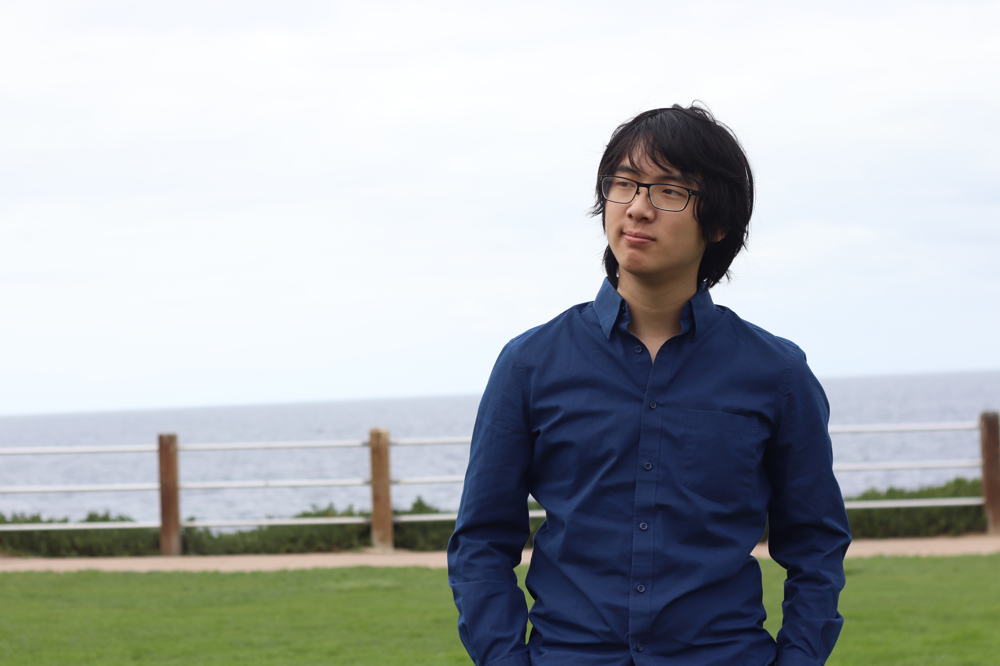

# Table of Contents
- [Table of Contents](#table-of-contents)
- [Introduction](#introduction)
- [Coding](#coding)
- [Hobbies](#hobbies)

# Introduction

[Link to picture of me](./images/me.jpg)
Hello! I'm Kyle, a third year Computer Engineering major in Sixth college. 

> __"I needed a quote but I couldn't think of one."__ - *Me, 2021*

# Coding
My main coding experience has been with embedded systems and web development. In order, here are my top three favorite languages: 
1. Haskell
2. C++
3. Python
I used to like Python a lot more until I started making larger applications with it and had to debug a lot of runtime errors. Compilers are great. 

You can take a look at my Github repo [here](https://github.com/falafel72).
Here's a Haskell code snippet that makes dad jokes: 
```haskell
import Data.List
import Data.Char
import Data.Maybe
import Control.Monad (when)

findDadJoke :: String -> Maybe Int
findDadJoke s = findIndex (isPrefixOf "i'm") (tails s)

lower :: String -> String
lower = map toLower

getDadString :: String -> Maybe String
getDadString s = do
    idx <- findDadJoke $ lower s
    return $ "Dad: hi" ++ drop (idx + 3) s
    
printMaybe :: Maybe String -> IO ()
printMaybe (Just s) = putStrLn s
printMaybe Nothing = return
    
main :: IO ()
main =  do
    line <- getLine
    printMaybe $ getDadString line
    main
```

# Hobbies
My current hobbies are reading, playing guitar, and listening to music, though there are a lot more things I want to get into. Here's part of my bucket list ~~that I just made up~~: 
 - [x] Pick up guitar
 - [x] Pick up bass guitar
 - [] Go scuba diving in San Diego 
 - [] Pick up the saxophone
 - [] Go to a Vulpeck concert